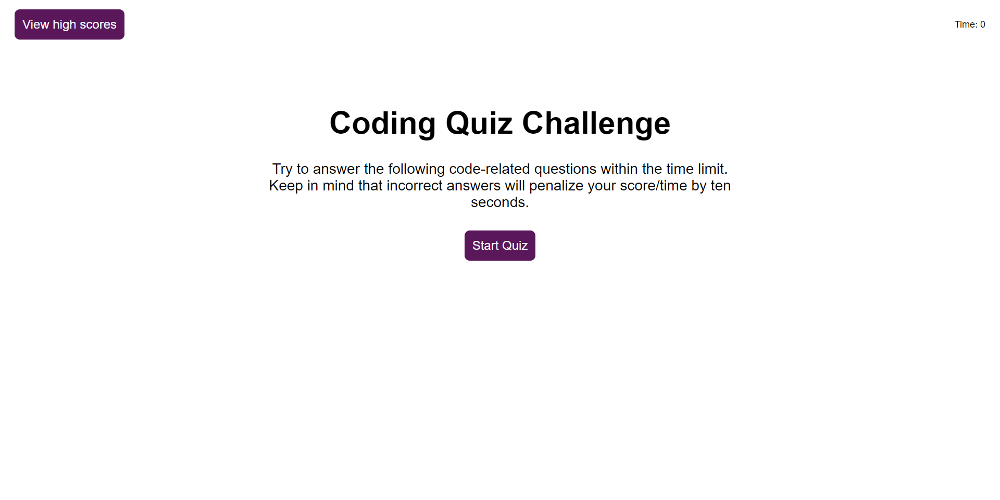

# CodeQuiz
## Description

Welcome to the Code Quiz repository!

The link below will take you to the website hosting the Code Quiz, where you will be challenged on your knowledge of JavaScript.  

## Application Details

The application was built primarily using JavaScript, with support from HTML and CSS to host the quiz. Within JavaScript, a number of functions were used to clear up the main quiz display and append new items to the document. In more detail, multiple data-* attributes were used to identify the correct answer of each question, which was checked upon the user's button click to determine if the correct answer was chosen and the application's response. The application also features a timer set using the setInterval() method, which will face penalties if an incorrect answer is chosen and will end the quiz if the timer runs out. Lastly, all high scores will be stored in localStorage to keep track!

**Languages Used**
- HTML
- CSS
- JavaScript

**User Story:**  
AS A coding boot camp student  
I WANT to take a timed quiz on JavaScript fundamentals that stores high scores  
SO THAT I can gauge my progress compared to my peers  

**Acceptance Criteria:**  
GIVEN I am taking a code quiz  
WHEN I click the start button  
THEN a timer starts and I am presented with a question  
WHEN I answer a question  
THEN I am presented with another question  
WHEN I answer a question incorrectly  
THEN time is subtracted from the clock  
WHEN all questions are answered or the timer reaches 0  
THEN the game is over  
WHEN the game is over  
THEN I can save my initials and score  

## Application Link and Screenshot
**Link to Application:**

[Coding Quiz Challenge](https://taimurhasan.github.io/CodeQuiz/)

**Screenshot of Application:**
